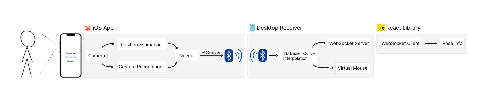

# 👋 Gesture
Most software today treats the screen like a piece of paper under a sheet of glass.
All interaction are glassy and feel like they have no connection with whatever task you were performing. 
Yet in the real world, we use our limbs and our whole bodies. Why should we limit our interactions to a single finger or two?
Ted Nelson, the guy who coined the terms hypertext and hypermedia, called the continued use of paper simulations as “like tearing the wings off a 747 and driving it as a bus on a highway.”
Is the future of computation really just sliding fingers around slabs of glass?

We think not.

Gesture is an experimental proof-of-concept that demonstrates that we can in fact use our bodies as input modes for our devices.
By only using consumer-grade sensors in smartphones, we can estimate users hand gestures and position and use it to control the computer.

Currently, Gesture exposes the hand pose information in one of two ways
1. As a virtual mouse, meaning you can move your mouse around and click and drag using just your hand
2. Programmatically, by connecting to a local Websocket server that streams the position data into client-side JavaScript

*Demo of using your hands to move and click*

*Demo of using both your hands (and depth information!) to control two table tennis paddles*

This project was made by [Anson Yu](https://www.ansonyu.me/) and [Jacky Zhao](https://jzhao.xyz/) at [Hack Lodge S22](https://hacklodge.org/).

## Setup
As of now, using Gesture requires installing the TestFlight for the iPhone controller which is still in beta. If you are interested, please message @_jzhao on Twitter if you'd like to get access and test.

1. Install the iOS Controller from Test Flight
2. Clone this repository
3. Install `go`
4. (OSX only) Enable Bluetooth for the terminal of your choice in System Preferences > Security & Privacy > Privacy > Bluetooth
5. `cd gesture/desktop`
6. `go install .`
7. Using the `gesture-react-sdk`: please see the documentation on [npm](https://www.npmjs.com/package/gesture-react-sdk)

### Input Mode Usage
0. Ensure Bluetooth is enabled and on for both your phone and computer
1. Start the Gesture receiver in virtual input mode (controls the mouse), run `gesture`
2. Open the iOS Controller
3. Press 'Start pairing to device'
4. Once you get the message 'Paired Successfully', press 'Start gesture recognition'
5. Point the phone camera at yourself or someone else. Their *right* hand will be used to control the mouse cursor.
6. To regain control over the mouse, exit the iOS Controller App, refocus the terminal and press `Ctrl + C` to end the program

### Websocket Mode Usage
0. Ensure Bluetooth is enabled and on for both your phone and computer
1. Start the Gesture receiver in Websocket server mode (streams data to applications), run `gesture --server`
2. Open the iOS Controller
3. Press 'Start pairing to device'
4. Once you get the message 'Paired Successfully', press 'Start gesture recognition'
5. Point the phone camera at yourself or someone else
6. Open your web app that is using `gesture-react-sdk` (or refresh the page if you already have it open)
7. Connection should be established and data should start streaming!

## Architecture

### iOS Controller (Swift)
The iOS app is responsible for actually doing the pose estimation using visual and depth data.
The application makes the phone act as a Bluetooth peripheral so it can stream data.

It takes in a camera feed and runs two processing streams on it in parallel:

1. Position Estimation using `ARBodyAnchor`
2. Gesture Recognition using `VNDetectHumanHandPoseRequest`

These resulting data points are added to a queue with a fixed capacity.
Position Estimation uses a capacity of 10 entries whereas Gesture Recognition uses a capacity of 3 entries.
We then send a windowed average every 100 milliseconds over Bluetooth, which helps to debounce inputs.

### Desktop Receiver (Go)
The Desktop receiver is a compiled binary which essentially acts as a Bluetooth central, looking for the closest iPhone with the Gesture controller open.

We also use a 3D spline interpolation algorithm to smooth out data points and provide a fluid stream of data rather than jumping around whenever we receive an update.
This means that we have a smooth stream of data on the `x`, `y`, and `z` positions of both left and right hands we can use.

By default, the Desktop receiver runs in Virtual input mode, which means it hijacks the systems mouse pointer through `uinput`.
However, this only uses the `x` and `y` information for the right hand. Afterall, we can't have more than one mouse cursor right? (actually, we did try to get multitouch working but that turned out to more of a pain than we thought it would be).
To fully utilize the `x`, `y`, and `z` info as well as the chirality information (which hand is left?), you can optionally run the Desktop receiver in Websocket server mode which... is pretty self-explanatory. It runs a Websocket server locally (`ws://localhost:8888`) which streams all of the hand data.

### React Hook (JavaScript)
`gesture-react-sdk` is a really thin wrapper around `react-use-websocket` that transforms the JSON stream into actual JS objects.
